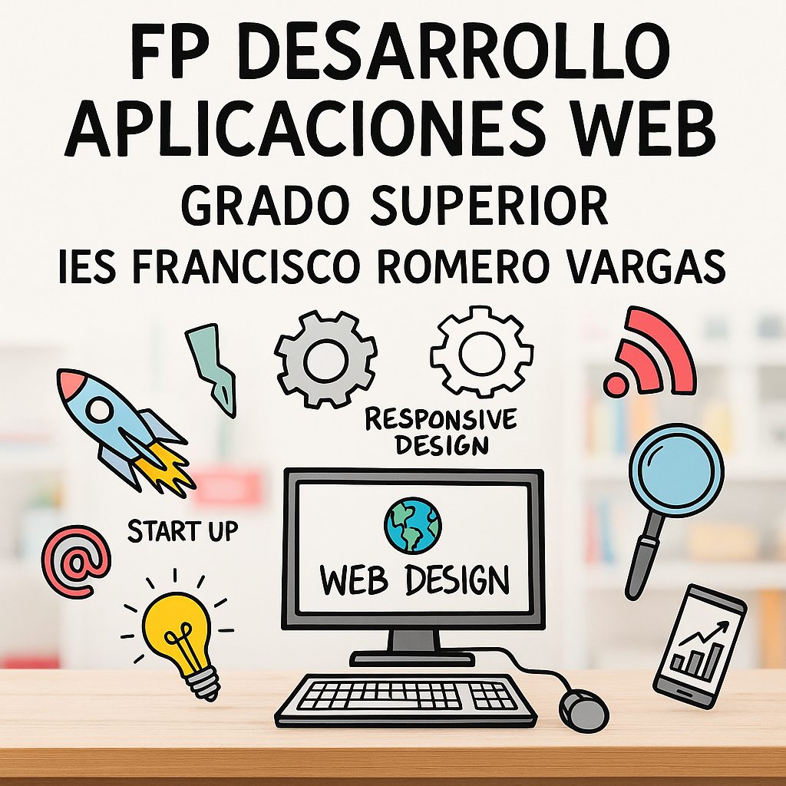

# 

# Anteproyecto

#  ArenaGG - Plataforma de gestión de torneos de videojuegos

## 👤 Autor del proyecto

Aarón Gutiérrez Caña

## 📌 Tabla de Contenidos

1. 📖 [Introducción](#-introducción-del-proyecto)
2. 🎯 [Finalidad](#-finalidad)
3. ✅ [Objetivos](#-objetivos)
4. 🛠️ [Tecnologías](#%EF%B8%8F-medios-hw-y-sf)
5. 📊 [Planificación](#-planificación)
6. 🔄 [Progreso](#-actualizaciones)
7. 📚 [Bibliografía](#-bibliografía)
8. 📄 [Documentación](#-documentación)
9. 📄 [Presentación](#-presentación)
   
## 📖 Introducción del proyecto

El objetivo principal del proyecto es desarrollar una plataforma web llamada **ArenaGG**, destinada a la organización y gestión de torneos de videojuegos como:

- 🎯 Valorant
- ⚔️ League of Legends
- 🔫 Counter-Strike 2

Esta plataforma permitirá a los usuarios:
- Gestionar multiple de torneos y equipo
- Seguir torneos en tiempo real
- Registrar su perfil y personalizarlo
- Consultar resultados
- Reclamar recompensas
- Convertirse en VIP
- Enviar mensajes a soporte
- Recibir notificaciones por correo

## 🎯 Finalidad
**ArenaGG** facilitará:
- La creación y administración sencilla de torneos de videojuegos.
- La automatización de procesos clave, como el emparejamiento y la generación de brackets (para 2, 4, 8 jugadores/equipos).
- Un sistema de puntos que los usuarios podrán canjear por:
  - 💰 Premios en efectivo
  - 🎚 Merchandising exclusivo
  - 📱 Suscripciones y beneficios dentro de la plataforma

## ✅ Objetivos

| Funcionalidad | Estado |
|--------------------------|--------|
| 🔐 Registro de usuarios | ✅ |
| 📝 Inscripción de equipos | ✅ |
| 🔄 Emparejamiento automático | ✅ |
| 📅 Resultados | ✅ |
| 🗂️ Gestión múltiple de torneos | ✅ |
| 🔔 Sistema de notificaciones por correo | ✅ |
| 🏆 Sistema de puntos/recompensas | ✅ |
| 👑 Membresía VIP | ✅ |
| 🛟 Sistema de soporte | ✅ |

## 🛠️ Medios hw y sf

### 💻 Hardware

- 🖥️ Intel i5+, 8GB RAM, SSD 256GB

### 📦 Software

| Área | Tecnologías |
|------|-------------|
| Backend | Python + Django + Celery/Celery-beat + Mailpit |
| Database | PostgreSQL + Redis |
| Frontend | HTML5, CSS3, Bootstrap 5, JS |
| Infra | Docker + AWS |
| Control | Git + GitHub |
| IDE | PyCharm |

## 📊 Planificación

### 📌 1. Análisis y diseño del sistema (1 semana)

- 📋 Definir requisitos funcionales y no funcionales.
- 📐 Crear diagramas de flujo y esquemas de base de datos.

### 🧑‍💻 2. Desarrollo del backend (3 semanas)

- 🔑 Implementar la autenticación de usuarios.
- 🔐 Registrar usuarios y crear perfiles personalizados.
- 📝 Inscribir equipos y jugadores en torneos específicos.
- 🔄 Automatizar el emparejamiento y generar los enfrentamientos.
- 📅 Mostrar resultados en tiempo real.
- 🗂️ Gestionar múltiples torneos de forma simultánea.
- 🔔 Sistema de notificaciones.
- 🏆 Sistema de puntos/recompensas.
- 👑 Membresía VIP.
- 🛟 Sistema de soporte.

### 🎨 3. Desarrollo del frontend (2 semanas)

- 🖌️ Diseñar las interfaces de usuario con **Bootstrap 5**.
- 🔗 Integrar las vistas con el backend.

### 📦 4. Contenerización y despliegue en AWS (2 semanas)

- 🐳 Dockerizar la aplicación para facilitar el despliegue.
- 🌐 Configurar la infraestructura en **AWS** (EC2 o ECS para la ejecución de contenedores).

### 🧪 5. Pruebas, validación y documentación (2 semanas)

- ✅ Realizar pruebas unitarias con **Django TestCase**.
- 📊 Validar el correcto funcionamiento de la plataforma.
- 📚 Redactar la documentación del sistema y el manual de usuario.

**⏳ Duración total estimada:** 10 semanas.
---

## 🔄 Actualizaciones

### Hecho

- 📋 Definir requisitos funcionales y no funcionales.
- 📐 Crear diagramas de flujo y esquemas de base de datos.
- 🔑 Implementar la autenticación de usuarios.
- 🐳 Dockerizar la aplicación para facilitar el despliegue
- 🔐 Registrar usuarios y crear perfiles personalizados.
- 📝 Inscribir equipos y jugadores en torneos específicos.
- 🔔 Ofrecer un sistema de notificaciones para informar a los usuarios sobre partidas y resultados. (Creado localmente es decir con mailpit, para despliegue tendría que cambiarlo)
- 🗂️ Gestionar múltiples torneos de forma simultánea.
- 🔄 Automatizar el emparejamiento y generar los enfrentamientos.
- 📅 Mostrar resultados en tiempo real.
- 🗂️ Gestionar múltiples torneos de forma simultánea.
- 🏆 Sistema de puntos/recompensas.
- 👑 Membresía VIP.
- 🛟 Sistema de soporte.
- 🛠️ Creación de tareas automatizadas.
- 🔗 Integrar las vistas con el backend.
- ✅ Realizar pruebas unitarias con **Django TestCase**.
- 📚 Redactar la documentación del sistema.
- 🖌️ Diseñar las interfaces de usuario con **Bootstrap 5**.
- 🌐 Configurar la infraestructura en **AWS** (EC2 o ECS para la ejecución de contenedores).
- 📊 Validar el correcto funcionamiento de la plataforma.

### En proceso

### Por hacer

### Problemas encontrados

- Sistema para la automatización de generación de brackets para equipos impares e eliminación de equipos que no se han presentado.
- Apariencia del calendario de torneos en la página principal.
- Gestión de equipos en general.

### Modificaciones sobre el proyecto plantado inicialmente (“Si no hemos realizado todo lo planificado”)

- He cambiado la gestión de torneos, es decir, solo gestiono torneos de 2, 4 y 8 equipos, necesitaría de más tiempo para implementar un sistema para gestionar equipos impares y automatizar el sistema de gestión de torneos con más equipos.
- He cambiado la gestión de equipos, los jugadores solo pueden unirse a un equipo y el lider de este es el único que puede modificarlo, es decir, un jugador tiene que tener muy claro a que equipo va a unirse porque no va a poder abandonarlo o unirse a otro si llega a participar en algún torneo con ese equipo. El tamaño de los integrantes de un equipo no puede variar una vez se ha participado en un torneo.
- He quitado el calendario con los torneos de la página principal.
- No he realizado test a todas las vistas de la página, ni he documentado todas en github, solo a algunas.
- No he realizado un manual de usuario.
- Automatizar el despliegue con actions de github.

### Posibles mejoras al proyecto (“Posibles mejoras futuras”)

- Añadir tareas automatizadas para modificar el estado de cada torneo y partida (por empezar, en proceso, finalizado) y enviar emails cada vez que vaya a empezar un torneo por ejemplo o haya algún problema. (Con redis, celery y celery-beat y mailpit)
- Sistema para comprobar que el resultado de las partidas proporcionado por cada equipo sea correcto y no tenga que internevir un administrador.
- AI para contestar a los mensajes de soporte automáticamente.
- Mixin personalizado para páginas en las que solo puedan acceder jugadores premium/vip.
- Sistema de paginación.
- Sistema para gestionar los torneos y equipos por juego, es decir, por ejemplo, Valorant tiene un máximo de jugadores de 5, una duración de partida de 45 min, hacer las validaciones y así con todos los juegos.
- Mejorar el sistema de MMR, hacerlo más complejo para que si los equipos que se enfrentan tiene mucha diferencia de MMR, fluctue más o menos al ganar o perder.
- Historial de partidas jugadas con el modelo MatchResult.
- Automatización de despliegue con actions de github.

### Mejoras implementadas al proyecto

- Añadir tareas automatizadas para modificar el estado de cada torneo y partida (por empezar, en proceso, finalizado) y enviar emails cada vez que vaya a empezar un torneo por ejemplo o haya algún problema. (Con redis, celery y celery-beat y mailpit)

## 📚 Bibliografía

- 🐍 [Python – Documentación oficial](https://docs.python.org/3/)
- 📜 [JavaScript – MDN Web Docs](https://developer.mozilla.org/en-US/docs/Web/JavaScript)
- 🌐 [HTML5 – MDN Web Docs](https://developer.mozilla.org/en-US/docs/Web/Guide/HTML/HTML5)
- 🎨 [Bootstrap 5.3 – Introducción](https://getbootstrap.com/docs/5.3/getting-started/introduction/)
- 🎨 [CSS – MDN Web Docs](https://developer.mozilla.org/en-US/docs/Web/CSS)
- 🐰 [Celery – Documentación oficial](https://docs.celeryq.dev/en/stable/)
- 🌟 [Django – Documentación oficial](https://docs.djangoproject.com/en/stable/)
- 🔗 [Django REST Framework – Documentación oficial](https://www.django-rest-framework.org/)
- 🧩 [Django Extensions – Documentación oficial](https://django-extensions.readthedocs.io/en/latest/)
- 🐞 [Django Debug Toolbar – Documentación oficial](https://django-debug-toolbar.readthedocs.io/en/latest/)
- 📧 [Mailpit – Documentación oficial](https://mailpit.axllent.org/docs/)
- 🐳 [Docker – Documentación oficial](https://docs.docker.com/)
- ☁️ [AWS – Documentación oficial](https://docs.aws.amazon.com/)

## 📄 Documentación

- ️🏗️ [Estructura del Proyecto y esquema de base de datos](docs/PROJECT_STRUCTURE.md)
- ⚙️ [Admin](docs/ADMIN.md)
- 🖼️ [Vistas](docs/VIEWS.md)
- ⏰ [Tareas programadas](docs/TASKS.md)
- 🧩 [Modelos](docs/MODELS.md)
- 📝 [Formularios](docs/FORMS.md)
- ✅ [Test](docs/TESTS.md)
- 🔄 [Serializadores](docs/SERIALIZERS.md)
- 🧠 [Funciones](docs/FUNCTIONS.md)
- 🎯 [Workflows](docs/WORKFLOWS.md)
- 🚀 [Compose](docs/DOCKER-COMPOSE.md)

## 📄 Presentación

- 🖼️ [Canva](https://www.canva.com/design/DAGplCVE9Us/QY6BAPe9e4b9MMpWUPcrpQ/edit?utm_content=DAGplCVE9Us&utm_campaign=designshare&utm_medium=link2&utm_source=sharebutton)

