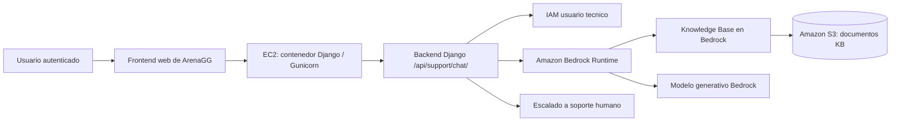

# Despliegue en la nube de ArenaGG

## 1. Introduccion

ArenaGG es una plataforma web para la gestion de torneos de videojuegos. El despliegue principal de la aplicacion se ha realizado en una instancia **EC2**, donde se ejecuta el contenedor con la aplicacion Django.

De forma independiente, el proyecto incorpora un bot de soporte con inteligencia artificial para resolver dudas frecuentes, reutilizar la base de conocimiento del proyecto y escalar a soporte humano cuando la respuesta no sea fiable.

Para este caso de uso se ha utilizado **AWS** como nube de pruebas, porque permite desplegar tanto la aplicacion principal en EC2 como los servicios administrados necesarios para el soporte IA.

El chat de soporte se integra con la aplicacion Django existente, que expone el endpoint protegido `POST /api/support/chat/`.

---

## 2. Arquitectura de despliegue

### 2.1 Aplicacion base (nucleo del proyecto)

La aplicacion base de ArenaGG no es el chat IA, sino la plataforma principal de torneos que se ejecuta en EC2. Sobre esa base funcional se integra, como modulo adicional, el soporte inteligente.

Funciones principales de la aplicacion base:

- Registro, login y gestion de perfiles de usuario.
- Creacion y gestion de equipos.
- Creacion y administracion de torneos.
- Gestion de partidas, resultados y clasificaciones.
- Sistema de recompensas y funcionalidades premium.
- Soporte tradicional por formulario y correo.

En este despliegue, el bot de soporte es una capa complementaria conectada a la misma aplicacion Django.

### Flujo resumido

1. El usuario entra en la aplicacion ArenaGG desplegada en EC2.
2. El frontend envia el mensaje al backend Django que corre en el contenedor.
3. Django consulta Amazon Bedrock para recuperar contexto de la Knowledge Base.
4. Bedrock devuelve fragmentos relevantes desde S3 y genera la respuesta con el modelo configurado.
5. Si la confianza es baja o el caso es sensible, se deriva a soporte humano.

---

## 3. Servicios de nube utilizados

### 3.1 IAM

**Funcion**: autenticar el acceso tecnico de la aplicacion a AWS.

**Configuracion usada**:

- Usuario IAM dedicado para el bot de soporte.
- Credenciales programaticas almacenadas en variables de entorno locales o del despliegue.
- Permisos para Bedrock y para acceso al bucket S3 de la base de conocimiento.

**Recomendacion**:

- Evitar la cuenta root.
- Reducir permisos a lo minimo necesario en produccion.

### 3.2 Amazon S3

**Funcion**: almacenar los documentos de la base de conocimiento que alimentan el bot.

**Configuracion usada**:

- Bucket privado en la region `us-east-1`.
- Acceso publico deshabilitado.
- Estructura de carpetas recomendada para documentos Markdown.

**Contenido habitual**:

- FAQ de usuarios.
- Guias de uso.
- Politicas y soporte.
- Glosario del proyecto.

### 3.3 Amazon Bedrock Knowledge Base

**Funcion**: indexar los documentos del bucket S3 y recuperar fragmentos relevantes para responder con contexto real.

**Configuracion usada**:

- Region: `us-east-1`.
- Knowledge Base ID actual del proyecto: `C5B2GIAZKP`.
- Vector store: S3 Vectors.

**Comportamiento**:

- El backend realiza retrieval sobre la KB.
- La respuesta generativa se construye con el contexto recuperado.

### 3.4 Amazon Bedrock Runtime

**Funcion**: generar la respuesta final del asistente.

**Configuracion usada**:

- Modelo por defecto: `amazon.nova-lite-v1:0`.
- Fallback de modelos: lista configurable mediante `BEDROCK_MODEL_CANDIDATES`.
- Region: `us-east-1`.

**Notas operativas**:

- Si un modelo no esta disponible en la cuenta, el backend prueba otro candidato.
- Esto evita que el chat falle por bloqueos de disponibilidad o de acceso al modelo.

### 3.5 Aplicacion Django en contenedor

**Funcion**: servir la interfaz web y la API del chat desde la aplicacion principal.

**Configuracion usada**:

- Ejecucion con Docker/Gunicorn.
- Aplicacion monolitica Django con frontend server-side (templates) y backend de negocio.
- Endpoint autentificado para el chat.
- Variables de entorno para AWS y la base de datos.
- Despliegue realizado en una instancia EC2.

**Capas funcionales dentro de la aplicacion base**:

- Capa de presentacion: paginas de usuario, torneos, equipos, ranking, recompensas y soporte.
- Capa de dominio: modelos y reglas de negocio para torneos, emparejamientos y resultados.
- Capa de procesos: tareas asincronas (por ejemplo, notificaciones) mediante Celery.
- Capa de soporte: formulario de contacto humano y endpoint de chat IA integrado.

**Nota**:

- Esta es la aplicacion principal del proyecto.
- El soporte IA se documenta aparte como un servicio complementario sobre Bedrock, S3 e IAM.

### 3.6 Workflow de despliegue

**Funcion**: automatizar la construccion, publicacion y despliegue del proyecto.

**Documentacion asociada**:

- [Workflow de despliegue en Docker & AWS](https://github.com/agutcan/anteproyecto/blob/sinFrontend2/docs/WORKFLOWS.md)

**Resumen**:

- El workflow construye la imagen Docker.
- Publica la imagen en Docker Hub.
- Despliega la aplicacion en AWS mediante la instancia EC2 configurada.
- El proceso completo se explica en [docs/WORKFLOWS.md](https://github.com/agutcan/anteproyecto/blob/sinFrontend2/docs/WORKFLOWS.md).

### 3.7 Uso del dominio .tech

**Funcion**: exponer la aplicacion y servicios asociados con una URL publica y profesional para pruebas de despliegue.

**Configuracion usada**:

- Dominio principal con extension `.tech` para la aplicacion web.
- Subdominios `.tech` para servicios auxiliares (por ejemplo, correo de pruebas o paneles tecnicos).
- Enrutamiento de peticiones hacia la instancia EC2 donde corre la aplicacion.

**Ventajas para el proyecto**:

- Permite validar el despliegue en condiciones cercanas a produccion.
- Facilita pruebas de acceso externo sin depender de IP publica en bruto.
- Mejora la presentacion de la plataforma durante la defensa y documentacion del proyecto.

---

## 4. Configuracion reproducible

### 4.1 Variables de entorno

Las variables minimas para reproducir la integracion son:

- `AWS_ACCESS_KEY_ID`
- `AWS_SECRET_ACCESS_KEY`
- `AWS_REGION=us-east-1`
- `BEDROCK_KB_ID=C5B2GIAZKP`
- `BEDROCK_MODEL_ID=amazon.nova-lite-v1:0`
- `BEDROCK_MODEL_CANDIDATES` (opcional)

### 4.2 Documentos de conocimiento

Subir al bucket S3 los documentos fuente del bot, por ejemplo:

- FAQ de soporte.
- Politicas de la plataforma.
- Guias de torneos, equipos y recompensas.
- Casos sensibles que deban escalarse a humano.

### 4.3 Verificacion del despliegue

1. Reiniciar la aplicacion para cargar las variables de entorno.
2. Abrir la pagina de soporte.
3. Enviar una consulta de prueba.
4. Verificar que la respuesta aparece con contexto de la KB.
5. Comprobar que los casos sensibles activan el escalado humano.

---

## 5. Estimacion de coste

La siguiente estimacion es orientativa para un entorno de pruebas con poco trafico. El coste real depende del uso, el volumen de documentos y la cantidad de consultas al modelo.

### 5.1 Costes fijos o muy bajos

- IAM: sin coste directo.
- S3 para la KB: coste bajo, dependiente del almacenamiento y peticiones.

### 5.2 Costes variables

- Amazon Bedrock Knowledge Base: depende de la ingesta y de las consultas de retrieval.
- Amazon Bedrock Runtime: depende de tokens de entrada y salida generados por el modelo.

### 5.3 Estimacion mensual de prueba

Para un escenario de laboratorio con uso reducido:

- S3: coste muy bajo, normalmente inferior a unos pocos euros al mes para pocos MB/GB.
- Bedrock: coste variable; en uso ligero suele ser moderado, pero puede crecer con consultas largas o frecuentes.

## 6. Manual breve de puesta en explotacion

1. Crear usuario IAM tecnico para la aplicacion.
2. Crear bucket S3 privado con la documentacion del soporte.
3. Crear la Knowledge Base en Bedrock y sincronizarla.
4. Configurar las variables de entorno en el despliegue.
5. Arrancar el backend Django en la instancia EC2 con acceso a AWS.
6. Ejecutar el workflow de despliegue cuando corresponda.
7. Probar el chat de soporte y validar el escalado a humano.

---