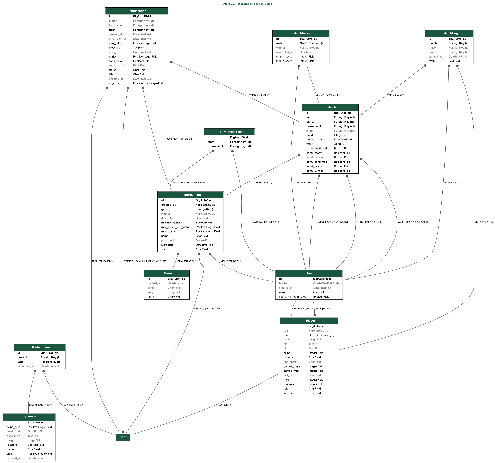

# 

# Informe de Presentación

#  ArenaGG - Plataforma de gestión de torneos de videojuegos

## 👤 Autor del proyecto

Aarón Gutiérrez Caña

---

## 📌 Tabla de Contenidos

1. 📖 [Memoria Técnica](#-memoria-técnica)
2. 📎 [Anexos de Evidencias](#-anexos-de-evidencias)
3. 🤖 [Declaración de uso de IA](#-declaración-de-uso-de-ia)

---

## 📖 Memoria Técnica

### 1. Introducción del proyecto

El objetivo principal del proyecto es desarrollar una plataforma web llamada **ArenaGG**, destinada a la organización y gestión de torneos de videojuegos como:

- Valorant
- League of Legends
- Counter-Strike 2

Esta plataforma permite a los usuarios:

- Gestionar múltiples torneos y equipos
- Seguir torneos en tiempo real
- Registrar su perfil y personalizarlo
- Consultar resultados
- Reclamar recompensas
- Convertirse en VIP
- Enviar mensajes a soporte
- Recibir notificaciones por correo

### 2. Finalidad

**ArenaGG** facilita:

- La creación y administración sencilla de torneos de videojuegos.
- La automatización de procesos clave, como el emparejamiento y la generación de brackets (para 2, 4, 8 equipos).
- Un sistema de puntos que los usuarios pueden canjear por:
  - Premios en efectivo
  - Merchandising exclusivo
  - Suscripciones y beneficios dentro de la plataforma

### 3. Objetivos

| Funcionalidad                           | Estado   |
|-----------------------------------------|----------|
| 🔐 Registro de usuarios                 | ✅       |
| 📝 Inscripción de equipos               | ✅       |
| 🔄 Emparejamiento automático            | ✅       |
| 📅 Resultados                           | ✅       |
| 🗂️ Gestión múltiple de torneos          | ✅       |
| 🔔 Sistema de notificaciones por correo | ✅       |
| 🏆 Sistema de puntos/recompensas        | ✅       |
| 👑 Membresía VIP                        | ✅       |
| 🛟 Sistema de soporte                   | ✅       |
| 🤖 Soporte IA con RAG y embeddings      | ✅       |
| 🔧 Debug Console para administradores   | ✅       |
| ☁️ Despliegue en AWS                    | ✅       |
| 🐳 Contenerización con Docker           | ✅       |
| ⚡ Tareas automatizadas con Celery      | ✅       |
| 🔄 CI/CD con GitHub Actions             | ✅       |

### 4. Tecnologías utilizadas

#### Hardware

- Intel i5+, 8GB RAM, SSD 256GB

#### Software

| Área     | Tecnologías                                    |
|----------|------------------------------------------------|
| Backend  | Python + Django + Celery/Celery-beat + Mailpit |
| Database | PostgreSQL + Redis                             |
| Frontend | HTML5, CSS3, Bootstrap 5, JS                   |
| API      | Django REST Framework + FastAPI (microservicio)|
| Infra    | Docker + AWS EC2 + Traefik                     |
| Control  | Git + GitHub                                   |
| CI/CD    | GitHub Actions                                 |
| IDE      | PyCharm                                        |

### 5. Planificación y desarrollo

#### 5.1 Fases del proyecto

| Fase | Descripción | Duración |
|------|-------------|----------|
| 1. Análisis y diseño | Definir requisitos funcionales y no funcionales. Crear diagramas de flujo y esquemas de base de datos. | 1 semana |
| 2. Desarrollo del backend | Autenticación, registro, inscripción de equipos, emparejamiento automático, resultados, gestión de torneos, notificaciones, recompensas, VIP, soporte, IA, Debug Console | 3 semanas |
| 3. Desarrollo del frontend | Diseñar interfaces con Bootstrap 5. Integrar vistas con backend. | 2 semanas |
| 4. Contenerización y despliegue | Dockerizar la aplicación. Configurar infraestructura en AWS EC2. | 2 semanas |
| 5. Pruebas, validación y documentación | Pruebas unitarias con Django TestCase. Validar funcionamiento. Documentar sistema. | 2 semanas |

**Duración total estimada:** 10 semanas.

#### 5.2 Modificaciones sobre el proyecto inicial

- Gestión de torneos limitada a 2, 4 y 8 equipos (formato de eliminatorias).
- Los jugadores solo pueden pertenecer a un equipo y el líder es el único que puede modificarlo.
- El tamaño del equipo no puede variar una vez participa en un torneo.
- No se ha realizado un manual de usuario independiente (en su lugar hay una página `how_it_work.html` que explica el uso de la plataforma).

#### 5.3 DAW — Mejoras del primer año

Durante el primer curso (DAW) se implementaron las siguientes mejoras sobre la base inicial del proyecto:

| Mejora | Descripción |
|--------|-------------|
| Tareas automatizadas | Actualización de estados de torneos y partidos (upcoming → ongoing → completed) mediante Celery, Celery-Beat y Redis |
| Envío de correos | Notificaciones por email a jugadores sobre inicio de partidos y resultados usando Mailpit en desarrollo |
| CI/CD con GitHub Actions | Workflow `docker_aws.yml` que construye la imagen Docker, la publica en Docker Hub y despliega automáticamente en AWS EC2 al hacer push a `main` |

#### 5.4 DAM — Mejoras del segundo año (curso actual)

En el segundo curso (DAM) se ha ampliado significativamente el proyecto con funcionalidades avanzadas:

| Mejora | Descripción | Tecnologías |
|--------|-------------|-------------|
| **Sistema de paginación** | Paginación del ranking de jugadores (10 por página) para mejorar el rendimiento y la experiencia de usuario | Django Paginator |
| **Black (Code Formatter)** | Formateo automático de código Python para mantener un estilo consistente en todo el proyecto | Black + pre-commit + CI check |
| **Soporte IA con RAG** | Chatbot inteligente que responde preguntas frecuentes basándose en documentación real de la plataforma. Incluye microservicio independiente en FastAPI, embeddings multilingües, índice vectorial FAISS y múltiples backends LLM (OpenAI, Mistral, Together, Bedrock) | FastAPI, FAISS, sentence-transformers, OpenAI/Bedrock/Mistral/Together |
| **Carrusel de noticias** | Carrusel automático en la página principal con noticias y anuncios de la plataforma, incluyendo streamers patrocinadores | Bootstrap 5 Carousel |
| **Debug Console** | Consola interactiva accesible con F12 que permite a administradores ejecutar consultas ORM de Django directamente desde el navegador, con historial de comandos y validación de seguridad | JavaScript, Django ORM |
| **Sistema de notificaciones** | Modelo `Notification` con cola de envío, niveles de urgencia, destinatarios múltiples y procesamiento asíncrono vía Celery. Sustituye los `send_mail` directos por un sistema trazable | Django, Celery |
| **Workflow reindexado de documentos** | GitHub Action `subirEC2-documents.yml` que detecta cambios en la base documental del chatbot y reindexa automáticamente el índice vectorial en la instancia EC2 | GitHub Actions, SSH |

Estas mejoras de DAM representan la evolución del proyecto hacia una plataforma más madura, escalable y automatizada, incorporando inteligencia artificial, DevOps y experiencia de usuario avanzada.

### 6. Arquitectura del sistema

#### 6.1 Estructura del proyecto

```
📂 anteproyecto/
│
├── 🧠 ArenaGG/                   # Configuración del proyecto Django
│   ├── settings.py              # Configuración global (BD, apps, middleware)
│   ├── urls.py                  # Enrutamiento de URLs global
│   ├── celery.py                # Configuración de Celery
│   └── wsgi.py                  # Punto de entrada WSGI
│
├── 🧩 web/                       # App principal: lógica de negocio
│   ├── models.py                # Modelos de base de datos (12 modelos)
│   ├── views.py                 # Vistas web y API
│   ├── forms.py                 # Formularios de Django
│   ├── functions.py             # Funciones auxiliares y lógica reutilizable
│   ├── tasks.py                 # Tareas asíncronas con Celery
│   ├── serializers.py           # Serializadores DRF
│   ├── admin.py                 # Configuración del panel admin
│   ├── tests/                   # Pruebas unitarias
│   └── templates/               # Plantillas HTML (25 páginas)
│
├── 🤖 subirEC2/                  # Microservicio FastAPI para soporte IA
│   ├── app/
│   │   ├── main.py              # API FastAPI (endpoints /chat, /reindex, /health)
│   │   ├── rag.py               # Lógica RAG (recuperación + generación)
│   │   ├── embeddings.py        # Modelos de embeddings
│   │   ├── vector_store.py      # Almacén vectorial FAISS
│   │   ├── ingest.py            # Indexado de documentos
│   │   └── providers/           # Proveedores LLM (OpenAI, Mistral, Together, Bedrock)
│   └── documents/               # Base documental del chatbot (11 archivos)
│
├── 📚 docs/                      # Documentación técnica (17 archivos)
├── 🐳 docker-compose.yml        # Orquestación de producción (9 servicios)
├── 🐳 Dockerfile                 # Imagen Docker del proyecto
└── 📂 .github/workflows/         # CI/CD (docker_aws.yml, subirEC2-documents.yml)
```

#### 6.2 Servicios desplegados

| Servicio       | Tecnología        | Descripción                         |
|----------------|-------------------|-------------------------------------|
| Traefik        | Reverse Proxy     | SSL automático, routing HTTP/HTTPS  |
| Web            | Django + Gunicorn | Aplicación principal (4 workers)    |
| PostgreSQL     | PostgreSQL 16     | Base de datos principal             |
| Redis          | Redis 7           | Broker de mensajes para Celery      |
| Celery         | Celery            | Workers para tareas asíncronas      |
| Celery Beat    | Celery            | Programador de tareas periódicas    |
| Mailpit        | SMTP              | Servidor de correo de pruebas       |
| Media Server   | Nginx             | Servidor de archivos multimedia     |
| subirEC2       | FastAPI           | Microservicio de soporte IA (RAG)   |

#### 6.3 Esquema de base de datos



**Modelos implementados (12):**

| Modelo           | Descripción                                    |
|------------------|------------------------------------------------|
| Game             | Videojuegos disponibles en la plataforma       |
| Tournament       | Torneos con estado, fechas, premios            |
| Team             | Equipos de jugadores                           |
| Player           | Perfil de jugador con estadísticas y MMR       |
| TournamentTeam   | Relación muchos-a-muchos Torneo-Equipo         |
| Match            | Partidos entre equipos dentro de un torneo     |
| MatchResult      | Resultados finales de partidos                 |
| MatchLog         | Registro de eventos durante partidos           |
| Reward           | Recompensas canjeables por monedas             |
| Redemption       | Historial de canjes de recompensas             |
| Notification     | Sistema de notificaciones internas y por correo|
| User (Django)    | Usuarios del sistema                           |

#### 6.4 Flujo de soporte IA (RAG)

```
Usuario → Soporte Django → POST /api/support/chat/ → subirEC2 (FastAPI)
                                                          ↓
                                              Recuperación FAISS (documentos indexados)
                                                          ↓
                                              LLM (OpenAI/Mistral/Together/Bedrock)
                                                          ↓
                                              Respuesta generada + fuentes
```

### 7. Presupuesto

#### 7.1 Infraestructura Cloud (mensual)

| Recurso               | Proveedor   | Coste mensual estimado |
|-----------------------|-------------|------------------------|
| x2 EC2 t3.small          | AWS         | 30,00 €                |
| x2 Elastic IP            | AWS         | 7,00 €                 |
| Dominio (arenagg.tech)| Registrador | 1,00 €                 |
| **Total mensual**     |             | **38,00 €**            |

#### 7.2 Herramientas y servicios

| Herramienta           | Tipo        | Coste        |
|-----------------------|-------------|--------------|
| GitHub                | Repositorio | Gratuito     |
| Docker Hub            | Registro    | Gratuito     |
| PyCharm Professional  | IDE         | Gratuito (estudiante) |
| Canva                 | Diseño      | Gratuito     |

#### 7.3 Horas de desarrollo

| Fase                       | Horas estimadas |
|----------------------------|-----------------|
| Análisis y diseño          | 20 h            |
| Desarrollo backend         | 80 h            |
| Desarrollo frontend        | 40 h            |
| Contenerización/despliegue | 30 h            |
| Pruebas y documentación    | 30 h            |
| **Total**                  | **200 h**       |

### 8. Bibliografía

- [Python – Documentación oficial](https://docs.python.org/3/)
- [Django – Documentación oficial](https://docs.djangoproject.com/en/stable/)
- [Django REST Framework – Documentación oficial](https://www.django-rest-framework.org/)
- [Celery – Documentación oficial](https://docs.celeryq.dev/en/stable/)
- [Bootstrap 5.3 – Documentación](https://getbootstrap.com/docs/5.3/getting-started/introduction/)
- [HTML5 – MDN Web Docs](https://developer.mozilla.org/en-US/docs/Web/Guide/HTML/HTML5)
- [CSS – MDN Web Docs](https://developer.mozilla.org/en-US/docs/Web/CSS)
- [JavaScript – MDN Web Docs](https://developer.mozilla.org/en-US/docs/Web/JavaScript)
- [Docker – Documentación oficial](https://docs.docker.com/)
- [AWS – Documentación oficial](https://docs.aws.amazon.com/)
- [Mailpit – Documentación oficial](https://mailpit.axllent.org/docs/)
- [Django Debug Toolbar – Documentación oficial](https://django-debug-toolbar.readthedocs.io/en/latest/)
- [Django Extensions – Documentación oficial](https://django-extensions.readthedocs.io/en/latest/)

---

## 📎 Anexos de Evidencias

### 1. Seguimiento del proyecto

No se ha utilizado un tablero Kanban externo (Trello, Jira, etc.). El seguimiento del proyecto se ha realizado directamente en el archivo `README.md` del repositorio, en la sección **"Actualizaciones"**, donde se ha ido marcando cada tarea completada, los problemas encontrados y las modificaciones sobre la planificación inicial.

El historial de commits en GitHub también sirve como registro de decisiones y avances del proyecto.

- Repositorio: `https://github.com/agutcan/anteproyecto`
- Rama principal: `main`

### 2. Pruebas de funcionamiento

Se han implementado **39 pruebas unitarias** utilizando **Django TestCase** y **Django REST Framework APITestCase**, distribuidas de la siguiente manera:

| Archivo              | Pruebas | Descripción                                        |
|----------------------|---------|----------------------------------------------------|
| `test_models.py`     | 10      | Creación y validación de modelos (Game, Team, Player, Tournament, Match, MatchResult, MatchLog, Reward, Redemption) |
| `test_views.py`      | 29      | Vistas (Index, Ranking, Torneos, Soporte, API, Premium, FAQ, etc.) |
| **Total**            | **39**  |                                                    |

#### Categorías de pruebas implementadas

- **Modelos**: Validación de creación, representación textual (`__str__`), restricciones (`unique_together`), relaciones FK/OneToOne/M2M.
- **Vistas**: Redirección para usuarios no autenticados, carga de templates correctos, filtros (nombre, juego, estado), contexto de respuesta, envío de correos/notificaciones.
- **API**: Endpoints REST (estadísticas de jugadores, chat de soporte), estructura JSON, cantidad de elementos devueltos, manejo de errores.
- **Mocking**: Uso de `unittest.mock.patch` para simular envío de correos y llamadas HTTP externas sin dependencias reales.
- **Calidad de código**: Validación de formato con **Black** (`python -m black --check .`) integrada en CI.

#### Evidencia de ejecución

Las pruebas fueron ejecutadas correctamente sin fallos. El output del comando `docker compose exec web python manage.py test web.tests -v 2`:

```
Found 39 test(s).
Creating test database for alias 'default' ('test_django_db')...

test_game_creation (web.tests.test_models.ModelTests.test_game_creation) ... ok
test_match_creation (web.tests.test_models.ModelTests.test_match_creation) ... ok
test_match_log_creation (web.tests.test_models.ModelTests.test_match_log_creation) ... ok
test_match_result_creation (web.tests.test_models.ModelTests.test_match_result_creation) ... ok
test_player_creation (web.tests.test_models.ModelTests.test_player_creation) ... ok
test_redemption_creation (web.tests.test_models.ModelTests.test_redemption_creation) ... ok
test_reward_creation (web.tests.test_models.ModelTests.test_reward_creation) ... ok
test_team_creation (web.tests.test_models.ModelTests.test_team_creation) ... ok
test_tournament_creation (web.tests.test_models.ModelTests.test_tournament_creation) ... ok
test_tournament_team_unique (web.tests.test_models.ModelTests.test_tournament_team_unique) ... ok
test_eval_query_returns_result (web.tests.test_views.DebugConsoleAPITest) ... ok
test_exec_query_modifies_db (web.tests.test_views.DebugConsoleAPITest) ... ok
test_forbidden_keyword_blocked (web.tests.test_views.DebugConsoleAPITest) ... ok
test_non_staff_forbidden (web.tests.test_views.DebugConsoleAPITest) ... ok
test_faq_view_status_and_template (web.tests.test_views.FaqViewTest) ... ok
test_logged_in_user_gets_index (web.tests.test_views.IndexViewTest) ... ok
test_redirect_if_not_logged_in (web.tests.test_views.IndexViewTest) ... ok
test_get_all_player_stats (web.tests.test_views.PlayerStatsListAPITest) ... ok
test_player_count (web.tests.test_views.PlayerStatsListAPITest) ... ok
test_response_structure (web.tests.test_views.PlayerStatsListAPITest) ... ok
test_privacy_policy_status_and_template (web.tests.test_views.PrivacyPolicyViewTest) ... ok
test_logged_in_user_sees_ranking (web.tests.test_views.RankingViewTest) ... ok
test_ranking_is_paginated_by_ten (web.tests.test_views.RankingViewTest) ... ok
test_redirect_if_not_logged_in (web.tests.test_views.RankingViewTest) ... ok
test_support_chat_service_unavailable (web.tests.test_views.SupportChatAPITests) ... ok
test_support_chat_success (web.tests.test_views.SupportChatAPITests) ... ok
test_form_submission_error_shows_error_message (web.tests.test_views.SupportViewTests) ... ok
test_redirect_if_not_logged_in (web.tests.test_views.SupportViewTests) ... ok
test_successful_form_submission_sends_email (web.tests.test_views.SupportViewTests) ... ok
test_terms_of_use_status_and_template (web.tests.test_views.TermsOfUseViewTest) ... ok
test_redirect_if_not_logged_in (web.tests.test_views.TournamentCreateViewTests) ... ok
test_tournament_creation_and_email (web.tests.test_views.TournamentCreateViewTests) ... ok
test_filter_by_game (web.tests.test_views.TournamentListViewTest) ... ok
test_filter_by_name (web.tests.test_views.TournamentListViewTest) ... ok
test_filter_by_status (web.tests.test_views.TournamentListViewTest) ... ok
test_redirect_if_not_logged_in (web.tests.test_views.TournamentListViewTest) ... ok
test_view_returns_all_tournaments_for_logged_user (web.tests.test_views.TournamentListViewTest) ... ok
test_redirect_if_not_logged_in (web.tests.test_views.UpgradeToPremiumViewTests) ... ok
test_upgrade_role_and_redirect (web.tests.test_views.UpgradeToPremiumViewTests) ... ok

----------------------------------------------------------------------
Ran 39 tests in 12.306s

OK
Destroying test database for alias 'default' ('test_django_db')...
System check identified no issues (0 silenced).
```

### 3. Registro de decisiones (Decision Log)

| Decisión | Justificación |
|----------|--------------|
| Usar Django (monolito) en lugar de arquitectura SPA+API | El proyecto es un TFG individual; Django MVT permite iterar más rápido con menos complejidad manteniendo DRF para endpoints API necesarios |
| Limitar torneos a 2, 4 y 8 equipos | El sistema de brackets y eliminatorias requiere potencias de 2 para generar enfrentamientos equilibrados automáticamente |
| Un jugador = un equipo | Simplifica la lógica de torneos, evita conflictos de disponibilidad y asegura compromiso con un solo equipo |
| Microservicio separado para IA (subirEC2) | Aísla las dependencias pesadas (FAISS, embeddings, LLMs) del servidor Django principal |
| Traefik como reverse proxy | Gestión automática de certificados SSL con Let's Encrypt y balanceo de carga integrado |
| Mailpit en lugar de un SMTP real en desarrollo | Permite probar el envío de correos sin riesgo de enviar emails reales durante el desarrollo |
| Notificaciones vía modelo Notification en lugar de send_mail directo | Mayor trazabilidad, cola de envío con Celery y posibilidad de consultar historial desde la UI |
| PostgreSQL en lugar de SQLite | Necesario para producción, soporta concurrencia real y es compatible con AWS RDS si se migra en el futuro |

---

## 🤖 Declaración de uso de IA

### Herramientas utilizadas

Durante el desarrollo de este proyecto se han utilizado las siguientes herramientas de inteligencia artificial:

- **ChatGPT** (OpenAI)
- **GitHub Copilot** (agente integrado en el IDE)

### Propósito y alcance del uso

Estas herramientas se han empleado como **asistentes de desarrollo** para las siguientes tareas:

| Área de uso                        | Descripción                                                                 |
|------------------------------------|-----------------------------------------------------------------------------|
| **Implementación de código**       | Generación de bloques de código para nuevas funcionalidades (vistas, modelos, formularios). |
| **Corrección de errores**          | Diagnóstico y resolución de bugs, errores de sintaxis y excepciones.       |
| **Comprensión de conceptos**       | Explicación de conceptos de Django, Celery, DRF y patrones de diseño.      |
| **Estudio y aprendizaje**          | Consultas sobre buenas prácticas, arquitectura de software y documentación de librerías. |
| **Documentación**                  | Redacción y estructuración de la documentación técnica en `docs/`.          |
| **Creación de tests**              | Generación de pruebas unitarias con Django TestCase y mocking.             |
| **Configuración de infraestructura**| Asistencia con Dockerfiles, docker-compose, GitHub Actions y despliegue en AWS. |

### Limitaciones y supervisión

Todo el código generado o sugerido por estas herramientas ha sido **revisado, validado y modificado manualmente** antes de ser incorporado al proyecto. Las herramientas de IA se han utilizado como complemento al desarrollo, no como sustituto del criterio técnico del desarrollador.

Ninguna sección de la memoria técnica ha sido generada íntegramente por IA sin revisión humana posterior.

---

## 🔄 Navegación

- ️🏗️ [Estructura del Proyecto y esquema de base de datos](https://github.com/agutcan/anteproyecto/blob/main/docs/PROJECT_STRUCTURE.md)
- ⚙️ [Admin](https://github.com/agutcan/anteproyecto/blob/main/docs/ADMIN.md)
- 🖼️ [Vistas](https://github.com/agutcan/anteproyecto/blob/main/docs/VIEWS.md)
- ⏰ [Tareas programadas](https://github.com/agutcan/anteproyecto/blob/main/docs/TASKS.md)
- 🧩 [Modelos](https://github.com/agutcan/anteproyecto/blob/main/docs/MODELS.md)
- 📝 [Formularios](https://github.com/agutcan/anteproyecto/blob/main/docs/FORMS.md)
- ✅ [Test](https://github.com/agutcan/anteproyecto/blob/main/docs/TESTS.md)
- 🔄 [Serializadores](https://github.com/agutcan/anteproyecto/blob/main/docs/SERIALIZERS.md)
- 🧠 [Funciones](https://github.com/agutcan/anteproyecto/blob/main/docs/FUNCTIONS.md)
- 🎯 [Workflows](https://github.com/agutcan/anteproyecto/blob/main/docs/WORKFLOWS.md)
- 🚀 [Compose](https://github.com/agutcan/anteproyecto/blob/main/docs/DOCKER-COMPOSE.md)
- 🤖 [Soporte IA](https://github.com/agutcan/anteproyecto/blob/main/docs/SUPPORT_AI.md)
- ☁️ [Despliegue del soporte en AWS](https://github.com/agutcan/anteproyecto/blob/main/docs/SUPPORT_AI_AWS.md)
- 🔧 [Debug Console](https://github.com/agutcan/anteproyecto/blob/main/docs/DEBUG_CONSOLE.md)
- ⬅️ [Volver al README principal](https://github.com/agutcan/anteproyecto/blob/main/README.md)
